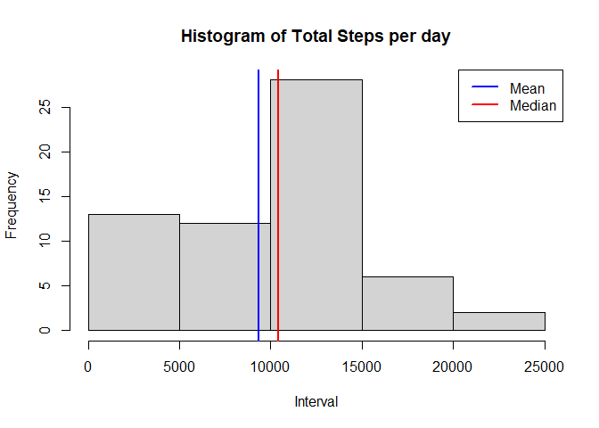
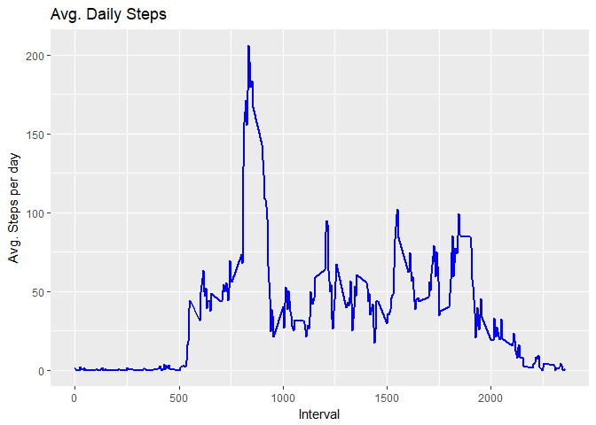
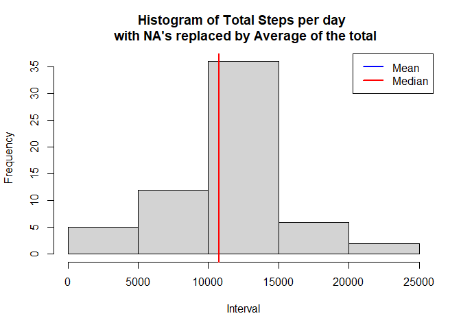
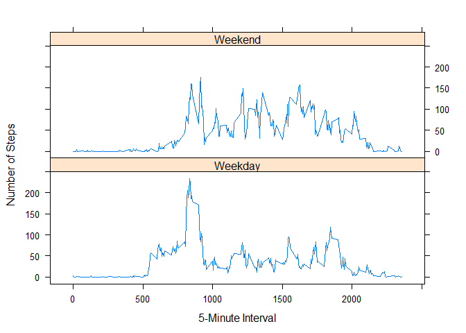

##Introduction 
I followed the following steps for my assignment. 


1. Code for reading in the dataset and/or processing the data
2. Histogram of the total number of steps taken each day
3. Mean and median number of steps taken each day
4. Time series plot of the average number of steps taken
5. The 5-minute interval that, on average, contains the maximum number of steps
6. Code to describe and show a strategy for imputing missing data
7. Histogram of the total number of steps taken each day after missing values are imputed
8. Panel plot comparing the average number of steps taken per 5-minute interval across weekdays and weekends
9. All of the R code needed to reproduce the results (numbers, plots, etc.) in the report

Library's used are:


```r
library(ggplot2)
library(dplyr)
```

```
## 
## Attaching package: 'dplyr'
```

```
## The following objects are masked from 'package:stats':
## 
##     filter, lag
```

```
## The following objects are masked from 'package:base':
## 
##     intersect, setdiff, setequal, union
```

```r
library(data.table)
```

```
## 
## Attaching package: 'data.table'
```

```
## The following objects are masked from 'package:dplyr':
## 
##     between, first, last
```

```r
library(zoo)
```

```
## 
## Attaching package: 'zoo'
```

```
## The following objects are masked from 'package:base':
## 
##     as.Date, as.Date.numeric
```

## 1. Code for reading in the dataset and/or processing the data
Here I load the data and take a look at the data. 


```r
Data <- read.csv('D:/Documents-Big/R DataScience/course 5/activity.csv')
str(Data)
```

```
## 'data.frame':	17568 obs. of  3 variables:
##  $ steps   : int  NA NA NA NA NA NA NA NA NA NA ...
##  $ date    : Factor w/ 61 levels "2012-10-01","2012-10-02",..: 1 1 1 1 1 1 1 1 1 1 ...
##  $ interval: int  0 5 10 15 20 25 30 35 40 45 ...
```


##2. Histogram of the total number of steps taken each day

Find the mean mean of steps taken each day:

```r
total_steps_per_Day<-aggregate(x = Data[c("steps")],
          FUN = sum,
          by = list(Date = Data$date), na.rm=TRUE)
```


Create Histogram with also adding in the mean and median steps taken. 


```r
hist(total_steps_per_Day$steps,
     col = "lightgray",
     border = "black", 
     xlab = "Interval",
     main = "Histogram of Total Steps per day")
abline(v = mean(total_steps_per_Day$steps),
       col = "blue",
       lwd = 2)
abline(v = median(total_steps_per_Day$steps),
       col = "red",
       lwd = 2)
legend(x = "topright", 
       c("Mean", "Median"),
       col = c("blue", "red"),
       lwd = c(2, 2, 2))
```

<!-- -->


##3. Mean and median number of steps taken each day


```r
Mean_steps_per_Day<-aggregate(x = Data[c("steps")],
                              FUN = mean,
                              by = list(Date = Data$date), na.rm=TRUE)

Median_steps_per_Day<-aggregate(x = Data[c("steps")],
                                FUN = median,
                                by = list(Date = Data$date), na.rm=TRUE)
Daily_Stats <- merge(Mean_steps_per_Day,Median_steps_per_Day,by="Date")
colnames(Daily_Stats)<-c("Date", "Mean", "Median")
```

##4. Time series plot of the average number of steps taken


```r
Mean_steps_per_Interval<-aggregate(x = Data[c("steps")],
                              FUN = mean,
                              by = list(Interval = Data$interval), na.rm=TRUE)
ggplot(Mean_steps_per_Interval, aes(x = Interval , y = steps)) + geom_line(color="blue", size=1) + 
        labs(title = "Avg. Daily Steps", x = "Interval", y = "Avg. Steps per day")
```

<!-- -->

##5. The 5-minute interval that, on average, contains the maximum number of steps


```r
maxStepsOn<-Data[which.max(Data$steps),]
```

The maximum number of steps happpened on `maxStepsOn`. 


##6. Code to describe and show a strategy for imputing missing data


```r
TotalMissingData<- sum(is.na(Data$steps))
```

I will just use the mean value for the full data set when a value is missing. 


```r
Data_NAReplace<-Data
Data_NAReplace$steps[which(is.na(Data_NAReplace$steps))] <- mean(Data_NAReplace$steps, na.rm = TRUE)
```


Example:


```r
head(Data_NAReplace, 5)
```

```
##     steps       date interval
## 1 37.3826 2012-10-01        0
## 2 37.3826 2012-10-01        5
## 3 37.3826 2012-10-01       10
## 4 37.3826 2012-10-01       15
## 5 37.3826 2012-10-01       20
```


##7. Histogram of the total number of steps taken each day after missing values are imputed


```r
total_steps_per_Day_NAReplace<-aggregate(x = Data_NAReplace[c("steps")],
                                         FUN = sum,
                                         by = list(Date = Data_NAReplace$date), na.rm=TRUE)

mean_steps_per_Day_NAReplace<-aggregate(x = Data_NAReplace[c("steps")],
                                        FUN = mean,
                                        by = list(Date = Data_NAReplace$date), na.rm=TRUE)

median_steps_per_Day_NAReplace<-aggregate(x = Data_NAReplace[c("steps")],
                                          FUN = median,
                                          by = list(Date = Data_NAReplace$date), na.rm=TRUE)

Daily_Stats_NAReplace <- merge(mean_steps_per_Day_NAReplace,median_steps_per_Day_NAReplace,by="Date")
colnames(Daily_Stats_NAReplace)<-c("Date", "Mean", "Median")


##  Histogram
hist(total_steps_per_Day_NAReplace$steps,
     col = "lightgray",
     border = "black", 
     xlab = "Interval",
     main = "Histogram of Total Steps per day \n with NA's replaced by Average of the total")


abline(v = mean(total_steps_per_Day_NAReplace$steps),
       col = "blue",
       lwd = 2)
abline(v = median(total_steps_per_Day_NAReplace$steps),
       col = "red",
       lwd = 2)
legend(x = "topright", 
       c("Mean", "Median"),
       col = c("blue", "red"),
       lwd = c(2, 2, 2))
```

<!-- -->


Do these values differ from the estimates from the first part of the assignment? What is the impact of imputing missing data on the estimates of the total daily number of steps?

There was no difference to the daily means. 


```r
meanTotalDifference<-sum(Daily_Stats$Mean-Daily_Stats_NAReplace$Mean, na.rm=TRUE)
meanTotalDifference
```

```
## [1] 0
```

```r
meanTotalDifference<-sum(Daily_Stats$Median-Daily_Stats_NAReplace$Median, na.rm=TRUE)
meanTotalDifference
```

```
## [1] 0
```


8. Panel plot comparing the average number of steps taken per 5-minute interval across weekdays and weekends


```r
library(lattice)
Data$dayOfWeek<-weekdays(as.Date(Data$date))
Data$DayType <- ifelse(Data$dayOfWeek %in% c("Saturday", "Sunday"), "Weekend", "Weekday")
Data_AgInt <- aggregate(Data$steps, by=list(Data$interval, Data$DayType),mean, na.rm=TRUE) 
names(Data_AgInt) <- c("interval", "DayType", "steps")
xyplot(steps ~ interval | DayType, Data_AgInt, type = "l", layout = c(1,2),
       xlab = "5-Minute Interval", ylab = "Number of Steps")
```

<!-- -->

